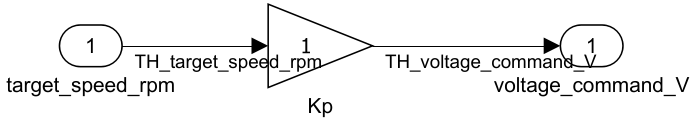
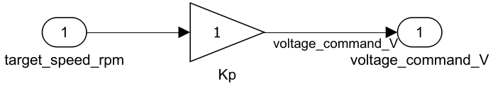

# cust_0001_signal_names: Signal naming convention

**Guideline ID:** cust_0001_signal_names

## Rules

- Signal lines shall have explicit, nonempty names.
- Signal line names shall start with the prefix `TH_`.

## Rationale

- Explicit signal names improve traceability between model behavior, requirements, tests, and generated code.
- A project prefix makes model interfaces easier to scan and reduces ambiguity when signals are logged, reused, or traced across referenced models.

## Verification

Model Advisor check: Signal names use TH_ prefix (`mathworks.custom.cust_0001_signal_names`)

## Example — Correct

All signal lines are named and use the `TH_` prefix.

## Example — Incorrect

One signal line is unnamed and another signal line is named without the `TH_` prefix.

